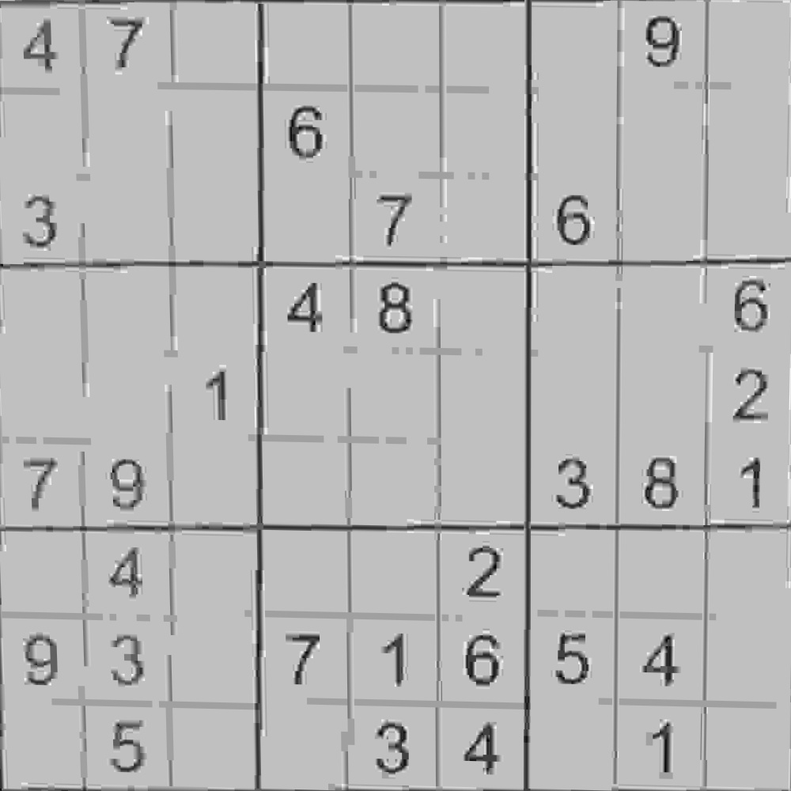

# Phase 1

The aim of phase 1 is to split the image into 81 tiles, each tile containing one small sudoku square, OCR can then by applied to these tiles in phase 2.

## Preprocessing

The first step in phase 1 is to read and preprocess the image. The image is read in gray scale.

### Detect inverted images

The first step in our preprocessing is to detect whether the image is inverted or not. Inverted images tend to have a small median but high standard deviation (unlike images with dark lighting which would have a low median and a low standard deviation or images that have low contrast which would have an average median but very low standard deviation.)

If the image is detected to be inverted we simply do a bitwise not operation to revert the image back to its normal shape.

### Histogram equalization

The second step is to apply histogram equalization to the image. This is helpful because it increase the contrast of low contrast images and increases the brightness of dark light images.

### Adaptive thresholding

The next step is to turn the image into a binary image so that we can have a cleared view of the image. We chose to use gaussian thresholding. The hyperparameters were chosen by trail and error.

### Morphological operations I

Next we do some morphological operations, the aim of which is to extract the border lines of the sudoku puzzle and remove any objects that may confuse the model in later stages.

#### Morphological I steps

1. Apply opening the image with a large opening kernel so that the borders would disappear in the opened image. $$Img_{open} = Open(Img)$$
2. Subtract the opened image from the original image so that only the borders remain in the image and any other objects would be removed. $$Img = Img - Img_{open}$$

### Morphological operations II

We then apply opening and closing on the image with small kernels. The aim of this step is to remove salt and pepper noise. We considered using a median blur but we found out that this method is more powerful in certain situations.

## Line detection

In this stage is to detect the straight lines in the image.

For this we used hough transform. Most hyperparameters were chosen by trail and error. The hough threshold was chosen to be high to only consider proper lines. The minimum line length was given a small value to find the borders in images where some the borders are not fully visible.

## Finding the intersections

Now we need to find the intersections between the extracted lines.

### Finding intersections steps

1. We iterate on every pair of lines.
2. We check the angle between the 2 lines. We only consider the intersections between lines that have an angle between 80 and 100 degrees. Other lines are not of our interest because we are trying to find the borders of the sudoku.
3. We get the intersection point of the 2 lines. For the point to be considered a border candidate it has to pass certain criteria. The point has to be near any of the 2 lines. The reason we did this instead of being near both the 2 lines is because that we wanted to consider intersection points between a line which is partially not visible and another regular line. If the point is not near any of the lines, it is considered irrelevant.

We then apply a step of removing redundant intersection points. In other words, if there is a cluster of intersection points we only keep one of them. This was done to speed up algorithms done on the intersection points.

## Finding the corner points

Once we have the intersection points, we find the corner points using the sum of the coordinates.

We tried to use a largest square algorithm but the problem was that if the image was taken from an angle the sudoku would not be a square but rather a trapezium.

## Perspective transform and splitting to tiles

We now have the corners so the next step is to apply perspective transform on the image to have an image that only contain the sudoku puzzle.

We then simply split the image into 81 equally sized squares.

Note that the output of phase 1 is the split original image, not the preprocessed image. This is because the focus of phase 1 is to find the corner points, therefor, much of the shape of the numbers is lost. We also think that preprocessing each tile on its own would have the most localized effects which is better than global preprocessing.

## Results

Next we will show phase 1 results of the test cases:

### 1- Normal

### 2- The Mighty Finger

### 3- Where Border

### 4- Compresso Espresso 

### 5- Ya3am Sheel El Coin Ya3am

### 6- Far and Curved

This is the only failed test case, not because it is curved but because there are other objects around the sudoku puzzle that confuse teh model.

### 7- El Noor Ata3

### 8- Mesh Shayef 7aga Ya3am

### 9- Normal 2

### 10- Mal7 w Felfel

### 11- Flash Bang

### 12- Broken Printer

### 13- Dark Mode

### 14- Sine

### 15- Gone with the wind

### 16- Something Went Terribly Wrong Here

